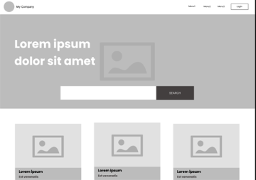
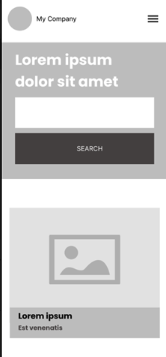
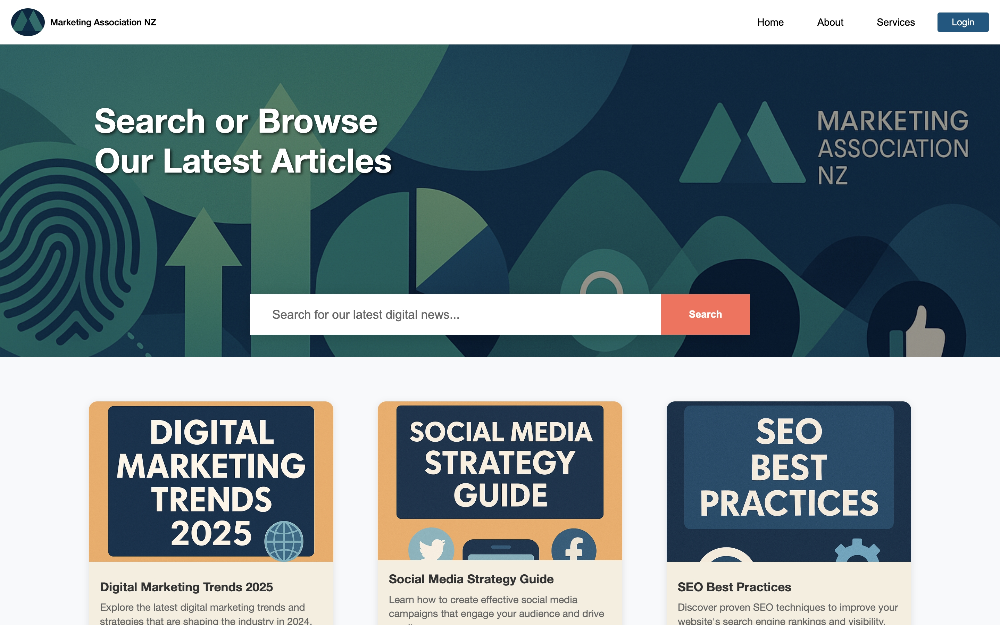
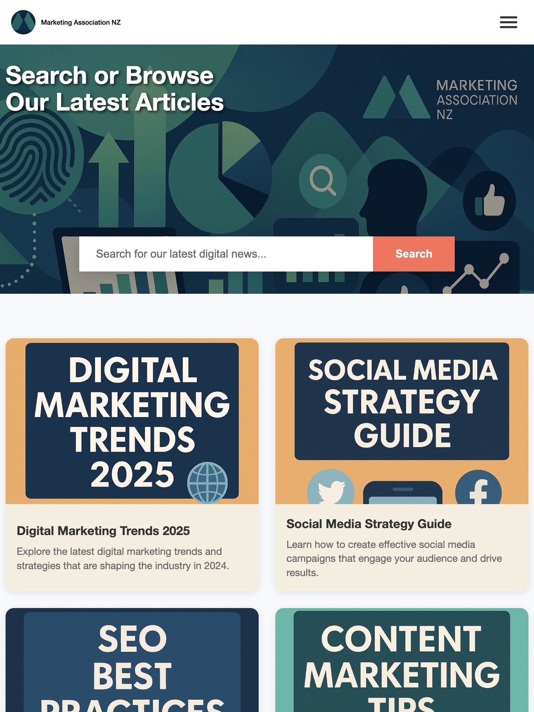

# Marketing Association NZ Website

Responsive website for Marketing Association NZ built with React and Vite.
This is a learning project for Mission Ready Level 5 Advanced Full Stack development program

## Features

- **Responsive Design** - Mobile-first approach with hamburger navigation
- **Hero Section** - Eye-catching banner with search functionality
- **Card Grid** - Dynamic article cards with hover effects
- **Modern UI** - Clean design with smooth transitions
- **Fast Performance** - Built with Vite for optimal loading speeds

## Tech Stack

- **Frontend**: React
- **Build Tool**: Vite
- **Styling**: CSS Modules

## Design & Wireframe

### Original Wireframes

<div align="center">
  
  
</div>

_Original wireframes showing desktop and mobile layouts_

## Screenshots

### Responsive Web Design

<div align="center">
  
#### Desktop View (1200px+)


#### Tablet View (768px - 1199px)



#### Mobile View (320px - 767px)


</div>

### Responsive Breakpoints

```css
/* Mobile Portrait */
@media (max-width: 576px) {
}

/* Tablet */
@media (max-width: 768px) {
}

/* Large Tablet */
@media (max-width: 884px) {
}

/* Desktop */
@media (min-width: 1200px) {
}
```
